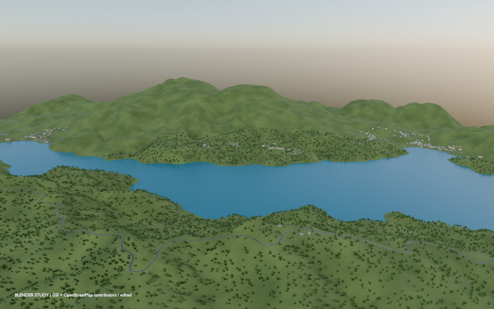
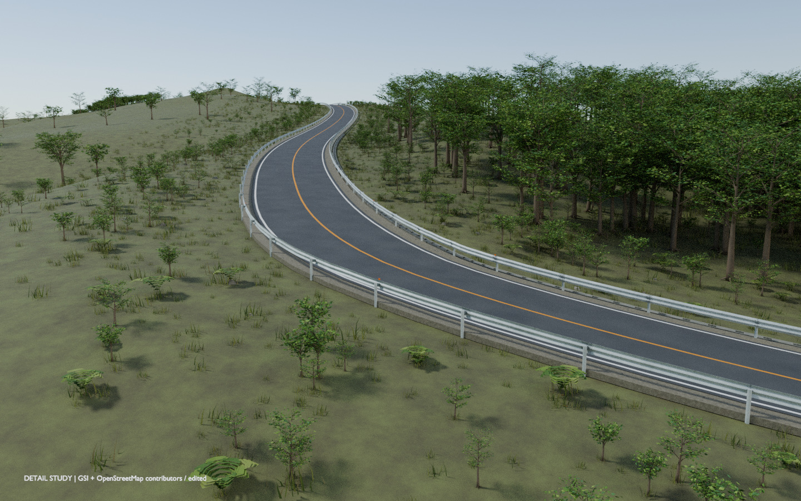
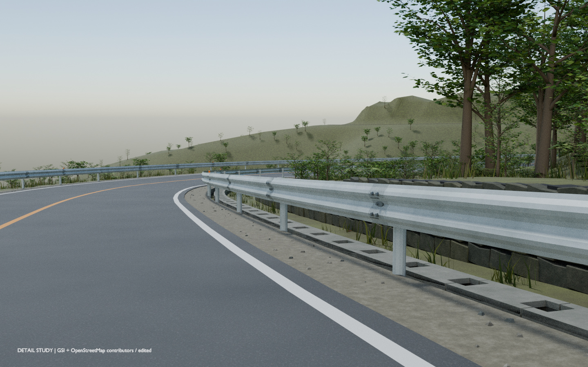
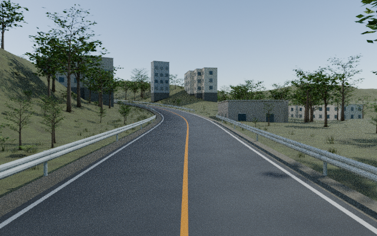
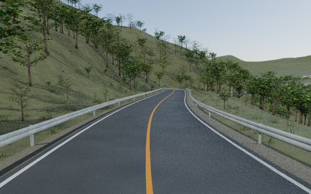

# 芦ノ湖 GT · コースデータ

[English](README.md) · [日本語](README.ja.md)

[KUROTORA DRIVE](https://github.com/Sunwood-ai-labs/ashinoko-kurotora-drive)から独立して管理するコースパックです。約25.03 kmの経路・風景・植生・schema・出典・描画エンジン非依存のデータ契約を収録しています。車体、操作、走行物理、公開ゲームはゲーム用リポジトリが担当します。



*湖と山並みを一望 · 地形ベース制作段階の全景. 実Blenderレンダー。ブラウザ版とは材質・LODが異なります。*

## 🏞️ 8つの視点で見る風景と地形

湖を見渡す全景から、ガードレールのボルトまで。表紙を含む8枚で、景色・起伏・沿道の作り込みを紹介します。

すべて実際のBlender制作モデルのレンダーです。ゲーム実機スクリーンショットではありません。地形ベース・v3詳細区間・v4全周確認を各キャプションで区別しています。元の解像度を保ち、大きい画像は配信用JPEGにしています。[画像の出典と撮影メモ](docs/GALLERY.md)。

| | |
|:---|:---|
|  |  |
| **森へ登るS字カーブ**<br>外側から見て分かる道路の曲線、登り勾配、森の境界。<br><sub>v3・西側詳細区間</sub> | **路肩まで作り込む**<br>波形ガードレールのボルト、側溝、石積み、足元の草を近くから。<br><sub>v3・西側詳細区間</sub> |

| | |
|:---|:---|
|  |  |
| **木々に沿うカーブ**<br>低い視点で、山肌を回り込む路面とガードレールの流れを見る。<br><sub>v4・6 km地点の確認視点</sub> | **木立の先に湖**<br>道の先が開け、木々の間に青い水面が見える区間。<br><sub>v4・12 km地点の確認視点</sub> |

| | |
|:---|:---|
|  |  |
| **建物のある坂道へ**<br>窓のある建物と上り坂が現れ、山間の道から景色が切り替わる。<br><sub>v4・21 km地点の確認視点</sub> | **山あいを抜ける道**<br>斜面と木々の間を縫う道。遠くまで見通せる構図で起伏をつかむ。<br><sub>v4・9 km地点の確認視点</sub> |


**一周の形をつかむ**<br>湖・地形・閉ループの関係を、強調したルート線で見渡す。<br><sub>地形ベースの旧25.04 km計画図・現ルートは25.03 km</sub>

標高：国土地理院。地図由来の形状：© OpenStreetMap contributors。芸術的な再構成です。[出典・権利の詳細](docs/DATA.md)。

## 📦 リポジトリと版

- コース正本：[ashinoko-course-data](https://github.com/Sunwood-ai-labs/ashinoko-course-data)、パック4.0.0、schema 1
- ゲーム本体：[ashinoko-kurotora-drive](https://github.com/Sunwood-ai-labs/ashinoko-kurotora-drive)
- 遊ぶ：[GitHub Pagesゲーム](https://sunwood-ai-labs.github.io/ashinoko-kurotora-drive/)
- ゲームは全ファイルのSHA-256を固定した、レビュー済みのコピーを同梱します。コース側の更新だけで公開ゲームが変わることはありません

## 🚀 検証とexport

Node.js 22以上を使用します。検証にnpmパッケージのインストールやネットワーク通信は不要です。

```sh
git clone https://github.com/Sunwood-ai-labs/ashinoko-course-data.git
cd ashinoko-course-data
npm test
npm run release:export -- ../ashinoko-course-export
```

新しい空のexport先を指定してください。完全exportには32の固定資源と `course-release.json` が含まれ、圧縮転送前で約98.3 MBです。契約・schema・権利・出典を含み、車体・描画エンジンは含みません。既存パックをまとめ直す機能で、Blender原形状の再生成機能ではありません。

## 🔁 ゲームへ取り込む

両リポジトリを隣同士にcloneし、ゲーム側で実行します。

```sh
npm run course:import -- --source ../ashinoko-course-data
npm test
```

既定では固定済みの同一版だけを取り込みます。内容をレビューして新しい版へ更新する場合は `npm run course:import -- --source ../ashinoko-course-data --accept-update`、続けて `npm run checksums` と `npm test` を実行し、同梱データとlockを一緒にcommitします。取込はローカルファイルだけを読み、改変・危険なパスを拒否します。取込コードそのものは実行しません。[更新手順](docs/MAINTENANCE.md)を参照してください。

## 🧭 データ契約

10,016点からなる全長25,031.460 mの閉ループ、209,834件の植生配置、manifestから参照する24資源を収録しています。単位はメートル。経路・配置はlocal Z-up、GLBはglTF Y-up、描画への変換は `[x, z, -y]` です。Meshopt圧縮を含むGLBは外部ファイルに依存しません。

- [構成と所有範囲](docs/ARCHITECTURE.md)
- [データの出典・精度・権利](docs/DATA.md)
- [検証・更新・ロールバック](docs/MAINTENANCE.md)
- [検証の限界](docs/VERIFICATION.md)
- [リポジトリ整備記録](docs/REPOSITORY_POLISH.md)

詳細ガイドは日本語です。日英READMEは同じ利用手順と制約を説明しています。

## ✅ 検証と制約

`npm test` はデータ契約・資産チェックサム・release一覧・ローカル文書リンクを検査します。CIはNode 22/24で検証し、確認用artifactをexportします。これだけで実描画・モバイル性能・ブラウザ操作の品質を保証するものではありません。

分離前の履歴は元のゲームリポジトリに残ります。[PROVENANCE.json](PROVENANCE.json)に分離元commitを記録しています。原Blenderファイルと地図・DEMの完全な作業セットは含まず、一部の取得情報は不明です。芸術的な再構成であり、ナビゲーション・測量・安全判断には使えません。

## 📄 権利と貢献

© OpenStreetMap contributors / ODbL、国土地理院の出典と条件を維持しています。原コード・制作資産に新たな包括的ライセンスは付けていません。再利用・変更前に[LICENSE.md](LICENSE.md)、[変更の提案](CONTRIBUTING.md)、[安全性](SECURITY.md)を確認してください。
